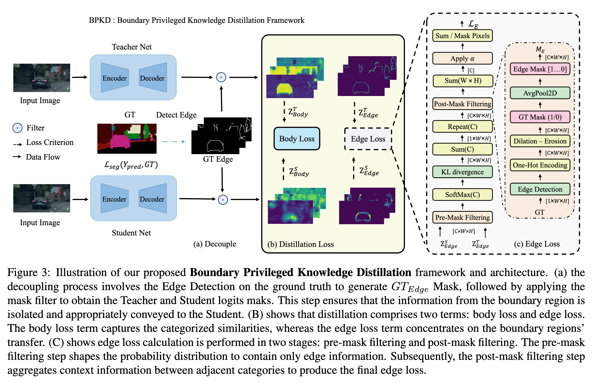

# BPKD : Boundary Privileged Knowledge Distillation For Semantic Segmentation
Authors: [Liyang Liu](https://www.linkedin.com/in/akideliu/), [Zihan Wang](https://www.linkedin.com/in/zihan-wang-68675a231/), [Minh Hieu Phan](https://scholar.google.com/citations?user=gSEw8EsAAAAJ&hl=en), [Bowen Zhang](https://github.com/zbwxp), [Jinchao Ge](https://github.com/jinchaogjc), [Yifan Liu](https://yifaninmemory.vmv.re/)*.  

*Corresponding author 

[[Paper](https://arxiv.org/abs/2306.08075)] [[Paper Fast Mirror](https://bpkd.vmv.re/resources/2306.08075v2.pdf)] [[Project](https://bpkd.vmv.re/)] [[Github](https://github.com/AkideLiu/BPKD)] [[Docker](https://github.com/orgs/UAws/packages/container/pytorch-sshd/73081261?tag=ngc-pytorch-1.13-mmcv-1.6.0-mmseg-0.26.0-ubuntu-20.04)] [[Pretrained models](https://github.com/AkideLiu/BPKD/releases)] [[Visualization](resources/viz.md)]

---

> **Abstract:** Current approaches for knowledge distillation in semantic segmentation tend to adopt a holistic approach that treats all spatial locations equally. However, for dense prediction tasks, it is crucial to consider the knowledge representation for different spatial locations in a different manner. Furthermore, edge regions between adjacent categories are highly uncertain due to context information leakage, which is particularly pronounced for compact networks. To address this challenge, this paper proposes a novel approach called boundary-privileged knowledge distillation (BPKD). BPKD distills the knowledge of the teacher model's body and edges separately from the compact student model. Specifically, we employ two distinct loss functions: 1) Edge Loss, which aims to distinguish between ambiguous classes at the pixel level in edge regions. 2) Body Loss, which utilizes shape constraints and selectively attends to the inner-semantic regions. Our experiments demonstrate that the proposed BPKD method provides extensive refinements and aggregation for edge and body regions. Additionally, the method achieves state-of-the-art distillation performance for semantic segmentation on three popular benchmark datasets, highlighting its effectiveness and generalization ability. BPKD shows consistent improvements over various lightweight semantic segmentation structures. 
>
> 

## What's New

- `18 Jul 2023` : Release evaluation code and weights for Pascal Context dataset. 
  **Training Code Coming Later This Year...**

- `17 Jul 2023` : Release evaluation code and weights for ADE20K dataset.

- `16 Jul 2023` : Release evaluation code and weights for Cityscape dataset.

## Environment

[mmrazor@8b57a07b5e6033dbd0052aeaf0f72668bdaecd00](https://github.com/open-mmlab/mmrazor/commit/8b57a07b5e6033dbd0052aeaf0f72668bdaecd00)

mmseg==0.26.0

mmcv-full==1.6.0

Checkout [requirements.txt](https://github.com/AkideLiu/BPKD/blob/main/BPKD/requirements.txt) for full requirements

Docker Image :

```
sudo docker run --gpus all -v ~/data:/data \
-e GITHUB_TOKEN="xxxx" \
-e WANDB_TOKEN="xxxx" \
-it --shm-size=64gb ghcr.io/uaws/pytorch-sshd:ngc-pytorch-1.13-mmcv-1.6.0-mmseg-0.26.0-ubuntu-20.04 /bin/bash
```

## Preparing Dataset

1. Cityscapes
2. PASCAL Context
3. ADE20K

According to MMseg: https://github.com/open-mmlab/mmsegmentation/blob/master/docs/en/dataset_prepare.md

## Evaluation

```bash
python tools/test.py {config.py} {checkpoint.pth} --eval mIoU
```

## Results and models

We conducted all experiments using 4 NVIDIA A100 GPUs on The University of Adelaide [High Performance Computing](https://www.adelaide.edu.au/technology/research/high-performance-computing/phoenix-on-premise-hpc) Cluster (HPC).

### Cityscapes 512x1024 80K

**Table: Performance on Cityscapes Dataset**

| Methods            | FLOPs(G) | Parameters(M) | mIoU(%) | mAcc(%) | Config | ckpt |
| ------------------ | -------- | ------------- | ------- | ------- | ------ | ---------- |
| T: PSPNet-R101     | 256.89   | 68.07         | 79.74   | 86.56   | [Config](https://github.com/open-mmlab/mmsegmentation/blob/master/configs/pspnet/pspnet_r101-d8_512x1024_80k_cityscapes.py) | [Model](https://download.openmmlab.com/mmsegmentation/v0.5/pspnet/pspnet_r101-d8_512x1024_80k_cityscapes/pspnet_r101-d8_512x1024_80k_cityscapes_20200606_112211-e1e1100f.pth) |
| S: PSPNet-R18      | 54.53    | 12.82         | 74.23   | 81.45   | [Config](https://github.com/open-mmlab/mmsegmentation/blob/master/configs/pspnet/pspnet_r18b-d8_512x1024_80k_cityscapes.py) | [Model](https://download.openmmlab.com/mmsegmentation/v0.5/pspnet/pspnet_r18b-d8_512x1024_80k_cityscapes/pspnet_r18b-d8_512x1024_80k_cityscapes_20201226_063116-26928a60.pth) |
| SKDS               | 54.53    | 12.82         | 76.13   | 82.58   | [Config](eval/configs/baseline/pspnet/pspnet_r18-d8_512x1024_80k_cityscapes.py) | [Model](https://github.com/AkideLiu/BPKD/releases/download/v0.0.1/skds_80k_pspnet_r18_cityscapes_student.pth) |
| IFVD               | 54.53    | 12.82         | 76.24 | 82.81 | [Config](eval/configs/baseline/pspnet/pspnet_r18-d8_512x1024_80k_cityscapes.py) | [Model](https://github.com/AkideLiu/BPKD/releases/download/v0.0.1/ifvd_80k_pspnet_r18_cityscapes_student.pth) |
| CIRKD              | 54.53    | 12.82         | 76.03   | 82.56   | [Config](eval/configs/baseline/pspnet/pspnet_r18-d8_512x1024_80k_cityscapes.py) | [Model](https://github.com/AkideLiu/BPKD/releases/download/v0.0.1/cirkd_80k_pspnet_r18_cityscapes_student.pth) |
| CWD                | 54.53    | 12.82         | 76.26   | 83.04   | [Config](eval/configs/baseline/pspnet/pspnet_r18-d8_512x1024_80k_cityscapes.py) | [Model](https://github.com/AkideLiu/BPKD/releases/download/v0.0.1/cwd_80k_pspnet_r18_cityscapes_student.pth) |
| **BPKD(Ours)**     | 54.53    | 12.82         | **77.57** | **84.47** | [Config](eval/configs/baseline/pspnet/pspnet_r18-d8_512x1024_80k_cityscapes.py) | [Model](https://github.com/AkideLiu/BPKD/releases/download/v0.0.1/bpkd_80k_pspnet_r18_cityscapes_student.pth) |
|  |  |  |  |  |  |  |
| T: HRNetV2P-W48    | 95.64    | 65.95         | 80.65   | 87.39   | [Config](https://github.com/open-mmlab/mmsegmentation/blob/master/configs/hrnet/fcn_hr48_512x1024_160k_cityscapes.py) | [Model](https://download.openmmlab.com/mmsegmentation/v0.5/hrnet/fcn_hr48_512x1024_160k_cityscapes/fcn_hr48_512x1024_160k_cityscapes_20200602_190946-59b7973e.pth) |
| S: HRNetV2P-W18S   | 10.49    | 3.97          | 75.31   | 83.71   | [Config](https://github.com/open-mmlab/mmsegmentation/blob/master/configs/hrnet/fcn_hr18s_512x1024_80k_cityscapes.py) | [Model](https://download.openmmlab.com/mmsegmentation/v0.5/hrnet/fcn_hr18s_512x1024_80k_cityscapes/fcn_hr18s_512x1024_80k_cityscapes_20200601_202700-1462b75d.pth) |
| SKDS               | 10.49    | 3.97          | 77.27   | 84.77   | [Config](eval/configs/baseline/hrnet/fcn_hr18s_512x1024_80k_cityscapes.py) | [Model](https://github.com/AkideLiu/BPKD/releases/download/v0.0.1/skds_80k_fcn_hrnet_18s_cityscapes_student.pth) |
| IFVD               | 10.49    | 3.97          | 77.18   | 84.74   | [Config](eval/configs/baseline/hrnet/fcn_hr18s_512x1024_80k_cityscapes.py) | [Model](https://github.com/AkideLiu/BPKD/releases/download/v0.0.1/ifvd_80k_fcn_hrnet_18s_cityscapes_student.pth) |
| CIRKD              | 10.49    | 3.97          | 77.36   | 84.97   |        |            |
| CWD                | 10.49    | 3.97          | 77.87   | 84.98   | [Config](eval/configs/baseline/hrnet/fcn_hr18s_512x1024_80k_cityscapes.py) | [Model](https://github.com/AkideLiu/BPKD/releases/download/v0.0.1/cwd_80k_fcn_hrnet_18s_cityscapes_student.pth) |
| **BPKD(Ours)**     | 10.49    | 3.97          | **78.58** | **85.78** | [Config](eval/configs/baseline/hrnet/fcn_hr18s_512x1024_80k_cityscapes.py) | [Model](https://github.com/AkideLiu/BPKD/releases/download/v0.0.1/bpkd_80k_fcn_hrnet_18s_cityscapes_student.pth) |
|  |  |  |  |  |  |  |
| T: DeeplabV3P-R101 | 255.67   | 62.68         | 80.98   | 88.7    | [Config](https://github.com/open-mmlab/mmsegmentation/blob/master/configs/deeplabv3/deeplabv3_r101-d8_512x1024_80k_cityscapes.py) | [Model](https://download.openmmlab.com/mmsegmentation/v0.5/deeplabv3/deeplabv3_r101-d8_512x1024_80k_cityscapes/deeplabv3_r101-d8_512x1024_80k_cityscapes_20200606_113503-9e428899.pth) |
| S: DeeplabV3P+MV2  | 69.60    | 15.35         | 75.29   | 83.11   | [Config](https://github.com/open-mmlab/mmsegmentation/blob/master/configs/mobilenet_v2/deeplabv3plus_m-v2-d8_512x1024_80k_cityscapes.py) | [Model](https://download.openmmlab.com/mmsegmentation/v0.5/mobilenet_v2/deeplabv3plus_m-v2-d8_512x1024_80k_cityscapes/deeplabv3plus_m-v2-d8_512x1024_80k_cityscapes_20200825_124836-d256dd4b.pth) |
| SKDS               | 69.60    | 15.35         | 76.05   | 84.14   | [Config](eval/configs/baseline/deeplabv3plus/deeplabv3plus_m-v2-d8_512x1024_80k_cityscapes.py) | [Model](https://github.com/AkideLiu/BPKD/releases/download/v0.0.1/skds_80k_deeplab_v3plus+mv2_cityscapes_student.pth) |
| IFVD               | 69.60    | 15.35         | 76.97   | 84.85   | [Config](eval/configs/baseline/deeplabv3plus/deeplabv3plus_m-v2-d8_512x1024_80k_cityscapes.py) | [Model](https://github.com/AkideLiu/BPKD/releases/download/v0.0.1/ifvd_80k_deeplab_v3plus+mv2_cityscapes_student.pth) |
| CIRKD              | 69.60    | 15.35         | 77.71   | 85.33   | [Config](eval/configs/baseline/deeplabv3plus/deeplabv3plus_m-v2-d8_512x1024_80k_cityscapes.py) | [Model](https://github.com/AkideLiu/BPKD/releases/download/v0.0.1/cirkd_80k_deeplab_v3plus+mv2_cityscapes_student.pth) |
| CWD                | 69.60    | 15.35         | 77.97   | 86.68 | [Config](eval/configs/baseline/deeplabv3plus/deeplabv3plus_m-v2-d8_512x1024_80k_cityscapes.py) | [Model](https://github.com/AkideLiu/BPKD/releases/download/v0.0.1/cwd_80k_deeplab_v3plus+mv2_cityscapes_student.pth) |
| **BPKD(Ours)**             | 69.60    | 15.35         | **78.59** | **86.45** | [Config](eval/configs/baseline/deeplabv3plus/deeplabv3plus_m-v2-d8_512x1024_80k_cityscapes.py) | [Model](https://github.com/AkideLiu/BPKD/releases/download/v0.0.1/bpkd_80k_deeplab_v3plus+mv2_cityscapes_student.pth) |
|  |  |  |  |  |  |  |
| T: ISANet-R101             | 228.21   | 56.80         | 80.61   | 88.29   | [Config](https://github.com/open-mmlab/mmsegmentation/blob/master/configs/isanet/isanet_r101-d8_769x769_80k_cityscapes.py) | [Model](https://download.openmmlab.com/mmsegmentation/v0.5/isanet/isanet_r101-d8_769x769_80k_cityscapes/isanet_r101-d8_769x769_80k_cityscapes_20210903_111319-24f71dfa.pth) |
| S: ISANet-R18              | 54.33    | 12.46         | 73.62   | 80.36   | [Config](eval/configs/baseline/isanet/isanet_r18-d8_512x1024_80k_cityscapes.py) | [Model](https://github.com/AkideLiu/BPKD/releases/download/v0.0.1/raw_80k_iasnet_r18_cityscapes.pth) |
| SKDS                       | 54.33    | 12.46         | 74.99   | 82.61   | [Config](eval/configs/baseline/isanet/isanet_r18-d8_512x1024_80k_cityscapes.py) | [Model](https://github.com/AkideLiu/BPKD/releases/download/v0.0.1/skds_80k_iasnet_r18_cityscapes_student.pth) |
| IFVD                       | 54.33    | 12.46         | 75.35   | 82.86   | [Config](eval/configs/baseline/isanet/isanet_r18-d8_512x1024_80k_cityscapes.py) | [Model](https://github.com/AkideLiu/BPKD/releases/download/v0.0.1/ifvd_80k_iasnet_r18_cityscapes_student.pth) |
| CIRKD                      | 54.33    | 12.46         | 75.41   | 82.92   | [Config](eval/configs/baseline/isanet/isanet_r18-d8_512x1024_80k_cityscapes.py) | [Model](https://github.com/AkideLiu/BPKD/releases/download/v0.0.1/cirkd_80k_iasnet_r18_cityscapes_student.pth) |
| CWD                        | 54.33    | 12.46         | 75.43   | 82.64   | [Config](eval/configs/baseline/isanet/isanet_r18-d8_512x1024_80k_cityscapes.py) | [Model](https://github.com/AkideLiu/BPKD/releases/download/v0.0.1/cwd_80k_iasnet_r18_cityscapes_student.pth) |
| **BPKD(Ours)**             | 54.33    | 12.46         | **75.72** | **83.65** | [Config](eval/configs/baseline/isanet/isanet_r18-d8_512x1024_80k_cityscapes.py) | [Model](https://github.com/AkideLiu/BPKD/releases/download/v0.0.1/bpkd_80k_iasnet_r18_cityscapes_student.pth) |


### **ADE20K** 512x512 80K

| Methods            | FLOPs(G) | Parameters(M) | mIoU(%) | mAcc(%) | Config | ckpt |
| ------------------ | -------- | ------------- | ------- | ------- | ------ | ---------- |
| T: PSPNet-R101    | 256\.89  |    68\.07     |    44\.39    |   54\.75   |[Config](https://github.com/open-mmlab/mmsegmentation/blob/main/configs/pspnet/pspnet_r101-d8_4xb4-160k_ade20k-512x512.py)|[Model](https://download.openmmlab.com/mmsegmentation/v0.5/pspnet/pspnet_r101-d8_512x512_160k_ade20k/pspnet_r101-d8_512x512_160k_ade20k_20200615_100650-967c316f.pth)|
| S: PSPnet-R18     |  54\.53  |    12\.82     |    33\.30    |   42\.58   |[Config](eval/configs/baseline/pspnet/pspnet_r18-d8_512x512_80k_ade20k.py)|[Model](https://github.com/AkideLiu/BPKD/releases/download/v0.0.2/raw_80k_pspnet_r18_ade20k_student.pth)|
| SKDS              |  54\.53  |    12\.82     |    34\.49    |   44\.28   |[Config](eval/configs/baseline/pspnet/pspnet_r18-d8_512x512_80k_ade20k.py)|[Model](https://github.com/AkideLiu/BPKD/releases/download/v0.0.2/skds_80k_pspnet_r18_ade20k_student.pth)|
| IFVD              |  54\.53  |    12\.82     |    34\.54    |   44\.26   |[Config](eval/configs/baseline/pspnet/pspnet_r18-d8_512x512_80k_ade20k.py)|[Model](https://github.com/AkideLiu/BPKD/releases/download/v0.0.2/ifvd_80k_pspnet_r18_ade20k_student.pth)|
| CIRKD             |  54\.53  |    12\.82     |    35\.07    |   45\.38   |[Config](eval/configs/baseline/pspnet/pspnet_r18-d8_512x512_80k_ade20k.py)|[Model](https://github.com/AkideLiu/BPKD/releases/download/v0.0.2/cirkd_80k_pspnet_r18_ade20k_student.pth)|
| CWD               |  54\.53  |    12\.82     |    37\.02    |   46\.33   |[Config](eval/configs/baseline/pspnet/pspnet_r18-d8_512x512_80k_ade20k.py)|[Model](https://github.com/AkideLiu/BPKD/releases/download/v0.0.2/cwd_80k_pspnet_r18_ade20k_student.pth)|
| **BPKD(Ours)**    |  54\.53  |    12\.82     |  **38\.51**  | **47\.70** |[Config](eval/configs/baseline/pspnet/pspnet_r18-d8_512x512_80k_ade20k.py)|[Model](https://github.com/AkideLiu/BPKD/releases/download/v0.0.2/bpkd_80k_pspnet_r18_ade20k_student.pth)|
| | | | | |||
| T: HRNetV2P-W48   |  95\.64  |    65\.95     |    42\.02    |   53\.52   |[Config](https://github.com/open-mmlab/mmsegmentation/blob/main/configs/hrnet/fcn_hr48_4xb4-160k_ade20k-512x512.py)|[Model](https://download.openmmlab.com/mmsegmentation/v0.5/hrnet/fcn_hr48_512x512_160k_ade20k/fcn_hr48_512x512_160k_ade20k_20200614_214407-a52fc02c.pth)|
| S: HRNetV2P-W18S  |  10\.49  |     3\.97     |    31\.38    |   41\.39   |[Config](https://github.com/open-mmlab/mmsegmentation/blob/main/configs/hrnet/fcn_hr18s_4xb4-80k_ade20k-512x512.py)|[Model](https://download.openmmlab.com/mmsegmentation/v0.5/hrnet/fcn_hr18s_512x512_80k_ade20k/fcn_hr18s_512x512_80k_ade20k_20200614_144345-77fc814a.pth)|
| SKDS              |  10\.49  |     3\.97     |    32\.57    |   43\.22   |[Config](eval/configs/baseline/hrnet/fcn_hr18s_512x512_80k_ade20k.py)|[Model](https://github.com/AkideLiu/BPKD/releases/download/v0.0.2/skds_80k_hrnet_r18_ade20k_student.pth)|
| IFVD              |  10\.49  |     3\.97     |    32\.66    |   43\.23   |[Config](eval/configs/baseline/hrnet/fcn_hr18s_512x512_80k_ade20k.py)|[Model](https://github.com/AkideLiu/BPKD/releases/download/v0.0.2/ifvd_80k_hrnet_r18_ade20k_student.pth)|
| CIRKD             |  10\.49  |     3\.97     |    33\.06    |   44\.30   |[Config](eval/configs/baseline/hrnet/fcn_hr18s_512x512_80k_ade20k.py)|[Model](https://github.com/AkideLiu/BPKD/releases/download/v0.0.2/cirkd_80k_hrnet_r18_ade20k_student.pth)|
| CWD               |  10\.49  |     3\.97     |    34\.00    |   42\.76   |[Config](eval/configs/baseline/hrnet/fcn_hr18s_512x512_80k_ade20k.py)|[Model](https://github.com/AkideLiu/BPKD/releases/download/v0.0.2/cwd_80k_hrnet_r18_ade20k_student.pth)|
| **BPKD(Ours)**    |  10\.49  |     3\.97     |  **35\.31**  | **46\.11** |[Config](eval/configs/baseline/hrnet/fcn_hr18s_512x512_80k_ade20k.py)|[Model](https://github.com/AkideLiu/BPKD/releases/download/v0.0.2/bpkd_80k_hrnet_r18_ade20k_student.pth)|
| | | | | |||
| T:DeeplabV3P-R101 | 255\.67  |    62\.68     |    45\.47    |   56\.41   |[Config](https://github.com/open-mmlab/mmsegmentation/blob/main/configs/deeplabv3plus/deeplabv3plus_r101-d8_4xb4-160k_ade20k-512x512.py)|[Model](https://download.openmmlab.com/mmsegmentation/v0.5/deeplabv3plus/deeplabv3plus_r101-d8_512x512_160k_ade20k/deeplabv3plus_r101-d8_512x512_160k_ade20k_20200615_123232-38ed86bb.pth)|
| S:DeeplabV3P+MV2  |  69\.60  |    15\.35     |    31\.56    |   45\.14   |[Config](eval/configs/baseline/deeplabv3plus/deeplabv3plus_m-v2-d8_512x512_80k_ade20k.py)|[Model](https://github.com/AkideLiu/BPKD/releases/download/v0.0.2/raw_80k_deeplab_v3plus+mv2_ade20k_student.pth)|
| SKDS              |  69\.60  |    15\.35     |    32\.49    |   46\.47   |[Config](eval/configs/baseline/deeplabv3plus/deeplabv3plus_m-v2-d8_512x512_80k_ade20k.py)|[Model](https://github.com/AkideLiu/BPKD/releases/download/v0.0.2/skds_80k_deeplab_v3plus+mv2_ade20k_student.pth)|
| IFVD              |  69\.60  |    15\.35     |    32\.11    |   46\.07   |[Config](eval/configs/baseline/deeplabv3plus/deeplabv3plus_m-v2-d8_512x512_80k_ade20k.py)|[Model](https://github.com/AkideLiu/BPKD/releases/download/v0.0.2/ifvd_80k_deeplab_v3plus+mv2_ade20k_student.pth)|
| CIRKD             |  69\.60  |    15\.35     |    32\.24    |   46\.09   |[Config](eval/configs/baseline/deeplabv3plus/deeplabv3plus_m-v2-d8_512x512_80k_ade20k.py)|[Model](https://github.com/AkideLiu/BPKD/releases/download/v0.0.2/cirkd_80k_deeplab_v3plus+mv2_ade20k_student.pth)|
| CWD               |  69\.60  |    15\.35     |    35\.12    |   49\.76   |[Config](eval/configs/baseline/deeplabv3plus/deeplabv3plus_m-v2-d8_512x512_80k_ade20k.py)|[Model](https://github.com/AkideLiu/BPKD/releases/download/v0.0.2/cwd_80k_deeplab_v3plus+mv2_ade20k_student.pth)|
| **BPKD(Ours)**    |  69\.60  |    15\.35     |  **35\.49**  | **53\.84** |[Config](eval/configs/baseline/deeplabv3plus/deeplabv3plus_m-v2-d8_512x512_80k_ade20k.py)|[Model](https://github.com/AkideLiu/BPKD/releases/download/v0.0.2/bpkd_80k_deeplab_v3plus+mv2_ade20k_student.pth)|
| | | | | |||
| T: ISANet-R101    | 228\.21  |    56\.80     |    43\.80    |   54\.39   |[Config](https://github.com/open-mmlab/mmsegmentation/blob/main/configs/isanet/isanet_r101-d8_4xb4-160k_ade20k-512x512.py)|[Model](https://download.openmmlab.com/mmsegmentation/v0.5/isanet/isanet_r101-d8_512x512_160k_ade20k/isanet_r101-d8_512x512_160k_ade20k_20210903_211431-a7879dcd.pth)|
| S: ISANet-R18     |  54\.33  |    12\.46     |    31\.15    |   41\.21   |[Config](eval/configs/baseline/isanet/isanet_r18-d8_512x512_80k_ade20k.py)|[Model](https://github.com/AkideLiu/BPKD/releases/download/v0.0.2/raw_80k_isanet_r18_ade20k_student.pth)|
| SKDS              |  54\.33  |    12\.46     |    32\.16    |   41\.80   |[Config](eval/configs/baseline/isanet/isanet_r18-d8_512x512_80k_ade20k.py)|[Model](https://github.com/AkideLiu/BPKD/releases/download/v0.0.2/skds_80k_isanet_r18_ade20k_student.pth)|
| IFVD              |  54\.33  |    12\.46     |    32\.78    |   42\.61   |[Config](eval/configs/baseline/isanet/isanet_r18-d8_512x512_80k_ade20k.py)|[Model](https://github.com/AkideLiu/BPKD/releases/download/v0.0.2/ifvd_80k_isanet_r18_ade20k_student.pth)|
| CIRKD             |  54\.33  |    12\.46     |    32\.82    |   42\.71   |[Config](eval/configs/baseline/isanet/isanet_r18-d8_512x512_80k_ade20k.py)|[Model](https://github.com/AkideLiu/BPKD/releases/download/v0.0.2/cirkd_80k_isanet_r18_ade20k_student.pth)|
| CWD               |  54\.33  |    12\.46     |    37\.56    |   45\.79   |[Config](eval/configs/baseline/isanet/isanet_r18-d8_512x512_80k_ade20k.py)|[Model](https://github.com/AkideLiu/BPKD/releases/download/v0.0.2/cwd_80k_isanet_r18_ade20k_student.pth)|
| **BPKD(Ours)**    |  54\.33  |    12\.46     |  **38\.73**  | **47\.92** |[Config](eval/configs/baseline/isanet/isanet_r18-d8_512x512_80k_ade20k.py)|[Model](https://github.com/AkideLiu/BPKD/releases/download/v0.0.2/bpkd_80k_isanet_r18_ade20k_student.pth)|


### Pascal Context 59 480*480 80k

| Methods            | FLOPs(G) | Parameters(M) | mIoU(%) | mAcc(%) | Config | ckpt |
| ------------------ | -------- | ------------- | ------- | ------- | ------ | ---------- |
| T: PSPNet-R101    | 256\.89  |    68\.07     |      52\.47       |   63\.15   |[Config](https://github.com/open-mmlab/mmsegmentation/blob/main/configs/pspnet/pspnet_r101-d8_4xb4-80k_pascal-context-59-480x480.py)|[Model](https://download.openmmlab.com/mmsegmentation/v0.5/pspnet/pspnet_r101-d8_480x480_80k_pascal_context_59/pspnet_r101-d8_480x480_80k_pascal_context_59_20210416_114418-fa6caaa2.pth)|
| S:PSPnet-R18      |  54\.53  |    12\.82     |      43\.79       |   54\.46   |[Config](eval/configs/baseline/pspnet/pspnet_r18-d8_480x480_80k_pascal_context_59.py)|[Model](https://github.com/AkideLiu/BPKD/releases/download/v0.0.3/raw_80k_pspnet_r18_pascal_context_59_student.pth)|
| SKDS              |  54\.53  |    12\.82     |      45\.08       |   55\.56   |[Config](eval/configs/baseline/pspnet/pspnet_r18-d8_480x480_80k_pascal_context_59.py)|[Model](https://github.com/AkideLiu/BPKD/releases/download/v0.0.3/skds_80k_pspnet_r18_pascal_context_59_student.pth)|
| IFVD              |  54\.53  |    12\.82     |      45\.97       |   56\.6    |[Config](eval/configs/baseline/pspnet/pspnet_r18-d8_480x480_80k_pascal_context_59.py)|[Model](https://github.com/AkideLiu/BPKD/releases/download/v0.0.3/ifvd_80k_pspnet_r18_pascal_context_59_student.pth)|
| CIRKD             |  54\.53  |    12\.82     |      45\.62       |   56\.15   |[Config](eval/configs/baseline/pspnet/pspnet_r18-d8_480x480_80k_pascal_context_59.py)|[Model](https://github.com/AkideLiu/BPKD/releases/download/v0.0.3/cirkd_80k_pspnet_r18_pascal_context_59_student.pth)|
| CWD               |  54\.53  |    12\.82     |      45\.99       |   55\.56   |[Config](eval/configs/baseline/pspnet/pspnet_r18-d8_480x480_80k_pascal_context_59.py)|[Model](https://github.com/AkideLiu/BPKD/releases/download/v0.0.3/cwd_80k_pspnet_r18_pascal_context_59_student.pth)|
| **BPKD(Ours)**    |  54\.53  |    12\.82     |    **46\.82**     | **56\.29** |[Config](eval/configs/baseline/pspnet/pspnet_r18-d8_480x480_80k_pascal_context_59.py)|[Model](https://github.com/AkideLiu/BPKD/releases/download/v0.0.3/bpkd_80k_pspnet_r18_pascal_context_59_student.pth)|
| | | | | |||
| T: HRNetV2P-W48   |  95\.64  |    65\.95     |      51\.12       |   61\.39   |[Config](https://github.com/open-mmlab/mmsegmentation/blob/main/configs/hrnet/fcn_hr48_4xb4-80k_pascal-context-59-480x480.py)|[Model](https://download.openmmlab.com/mmsegmentation/v0.5/hrnet/fcn_hr48_480x480_80k_pascal_context_59/fcn_hr48_480x480_80k_pascal_context_59_20210411_003240-3ae7081e.pth)|
| S:HRNetV2P-W18S   |  10\.49  |     3\.97     |      40\.62       |   51\.43   |||
| SKDS              |  10\.49  |     3\.97     |      41\.54       |   52\.18   |[Config](eval/configs/baseline/hrnet/fcn_hr18s_480x480_80k_pascal_context_59.py)|[Model](https://github.com/AkideLiu/BPKD/releases/download/v0.0.3/skds_80k_hrnet_w18s_pascal_context_59_student.pth)|
| IFVD              |  10\.49  |     3\.97     |      41\.55       |   52\.24   |[Config](eval/configs/baseline/hrnet/fcn_hr18s_480x480_80k_pascal_context_59.py)|[Model](https://github.com/AkideLiu/BPKD/releases/download/v0.0.3/ifvd_80k_hrnet_w18s_pascal_context_59_student.pth)|
| CIRKD             |  10\.49  |     3\.97     |      42\.02       |   52\.88   |[Config](eval/configs/baseline/hrnet/fcn_hr18s_480x480_80k_pascal_context_59.py)|[Model](https://github.com/AkideLiu/BPKD/releases/download/v0.0.3/cirkd_80k_hrnet_w18s_pascal_context_59_student.pth)|
| CWD               |  10\.49  |     3\.97     |      42\.89       |   53\.37   |[Config](eval/configs/baseline/hrnet/fcn_hr18s_480x480_80k_pascal_context_59.py)|[Model](https://github.com/AkideLiu/BPKD/releases/download/v0.0.3/cwd_80k_hrnet_w18s_pascal_context_59_student.pth)|
| **BPKD(Ours)**    |  10\.49  |     3\.97     |    **43\.96**     | **54\.51** |[Config](eval/configs/baseline/hrnet/fcn_hr18s_480x480_80k_pascal_context_59.py)|[Model](https://github.com/AkideLiu/BPKD/releases/download/v0.0.3/bpkd_80k_hrnet_w18s_pascal_context_59_student.pth)|
| | | | | |||
| T:DeeplabV3P-R101 | 255\.67  |    62\.68     |      53\.20       |   64\.04   |[Config](https://github.com/open-mmlab/mmsegmentation/blob/main/configs/deeplabv3plus/deeplabv3plus_r101-d8_4xb4-80k_pascal-context-59-480x480.py)|[Model](https://download.openmmlab.com/mmsegmentation/v0.5/deeplabv3plus/deeplabv3plus_r101-d8_480x480_80k_pascal_context_59/deeplabv3plus_r101-d8_480x480_80k_pascal_context_59_20210416_111127-7ca0331d.pth)|
| S:DeeplabV3P+MV2  |  69\.60  |    15\.35     |      41\.01       |   52\.92   |[Config](eval/configs/baseline/deeplabv3plus/deeplabv3plus_m-v2-d8_480x480_80k_pascal_context_59.py)|[Model](https://github.com/AkideLiu/BPKD/releases/download/v0.0.3/raw_80k_deeplab_v3plus+mv2_pascal_context_59_student.pth)|
| SKDS              |  69\.60  |    15\.35     |      42\.07       |   55\.06   |[Config](eval/configs/baseline/deeplabv3plus/deeplabv3plus_m-v2-d8_480x480_80k_pascal_context_59.py)|[Model](https://github.com/AkideLiu/BPKD/releases/download/v0.0.3/skds_80k_deeplab_v3plus+mv2_pascal_context_59_student.pth)|
| IFVD              |  69\.60  |    15\.35     |      41\.73       |   54\.34   |[Config](eval/configs/baseline/deeplabv3plus/deeplabv3plus_m-v2-d8_480x480_80k_pascal_context_59.py)|[Model](https://github.com/AkideLiu/BPKD/releases/download/v0.0.3/ifvd_80k_deeplab_v3plus+mv2_pascal_context_59_student.pth)|
| CIRKD             |  69\.60  |    15\.35     |      42\.25       |   55\.12   |[Config](eval/configs/baseline/deeplabv3plus/deeplabv3plus_m-v2-d8_480x480_80k_pascal_context_59.py)|[Model](https://github.com/AkideLiu/BPKD/releases/download/v0.0.3/cirkd_80k_deeplab_v3plus+mv2_pascal_context_59_student.pth)|
| CWD               |  69\.60  |    15\.35     |      43\.74       |   56\.37   |[Config](eval/configs/baseline/deeplabv3plus/deeplabv3plus_m-v2-d8_480x480_80k_pascal_context_59.py)|[Model](https://github.com/AkideLiu/BPKD/releases/download/v0.0.3/cwd_80k_deeplab_v3plus+mv2_pascal_context_59_student.pth)|
| **BPKD(Ours)**    |  69\.60  |    15\.35     |    **46\.23**     | **58\.12** |[Config](eval/configs/baseline/deeplabv3plus/deeplabv3plus_m-v2-d8_480x480_80k_pascal_context_59.py)|[Model](https://github.com/AkideLiu/BPKD/releases/download/v0.0.3/bpkd_80k_deeplab_v3plus+mv2_pascal_context_59_student.pth)|
| | | | | |||
| T:ISANet-R101     | 228\.21  |    56\.80     |      53\.41       |   64\.04   |[Config](eval/configs/baseline/isanet/isanet_r101-d8_512x512_80k_context.py)|[Model](https://github.com/AkideLiu/BPKD/releases/download/v0.0.3/raw_80k_isanet_r18_pascal_context_59_teacher.pth)|
| S: ISANet-R18     |  54\.33  |    12\.46     |      44\.05       |   54\.67   |[Config](eval/configs/baseline/isanet/isanet_r18-d8_480x480_80k_context.py)|[Model](https://github.com/AkideLiu/BPKD/releases/download/v0.0.3/raw_80k_isanet_r18_pascal_context_59_student.pth)|
| SKDS              |  54\.33  |    12\.46     |      45\.69       |   56\.27   |[Config](eval/configs/baseline/isanet/isanet_r18-d8_480x480_80k_context.py)|[Model](https://github.com/AkideLiu/BPKD/releases/download/v0.0.3/skds_80k_isanet_r18_pascal_context_59_student.pth)|
| IFVD              |  54\.33  |    12\.46     |      46\.75       |   56\.4    |[Config](eval/configs/baseline/isanet/isanet_r18-d8_480x480_80k_context.py)|[Model](https://github.com/AkideLiu/BPKD/releases/download/v0.0.3/ifvd_80k_isanet_r18_pascal_context_59_student.pth)|
| CIRKD             |  54\.33  |    12\.46     |      45\.83       |   56\.11   |[Config](eval/configs/baseline/isanet/isanet_r18-d8_480x480_80k_context.py)|[Model](https://github.com/AkideLiu/BPKD/releases/download/v0.0.3/cirkd_80k_isanet_r18_pascal_context_59_student.pth)|
| CWD               |  54\.33  |    12\.46     |      46\.76       |   56\.48   |[Config](eval/configs/baseline/isanet/isanet_r18-d8_480x480_80k_context.py)|[Model](https://github.com/AkideLiu/BPKD/releases/download/v0.0.3/cwd_80k_isanet_r18_pascal_context_59_student.pth)|
| **BPKD(Ours)**    |  54\.33  |    12\.46     |    **47\.25**     | **56\.81** |[Config](eval/configs/baseline/isanet/isanet_r18-d8_480x480_80k_context.py)|[Model](https://github.com/AkideLiu/BPKD/releases/download/v0.0.3/bpkd_80k_isanet_r18_pascal_context_59_student.pth)|


## License

For academic use, this project is licensed under the 2-clause BSD License - see the LICENSE file for details. For commercial use, please contact the corresponding author.

## Citation

```bash
@article{liu2023bpkd,
  title={BPKD: Boundary Privileged Knowledge Distillation For Semantic Segmentation},
  author={Liu, Liyang and Wang, Zihan and Phan, Minh Hieu and Zhang, Bowen and Liu, Yifan},
  journal={arXiv preprint arXiv:2306.08075},
  year={2023}
}
```


## Code

Training Code Coming Soon ...
